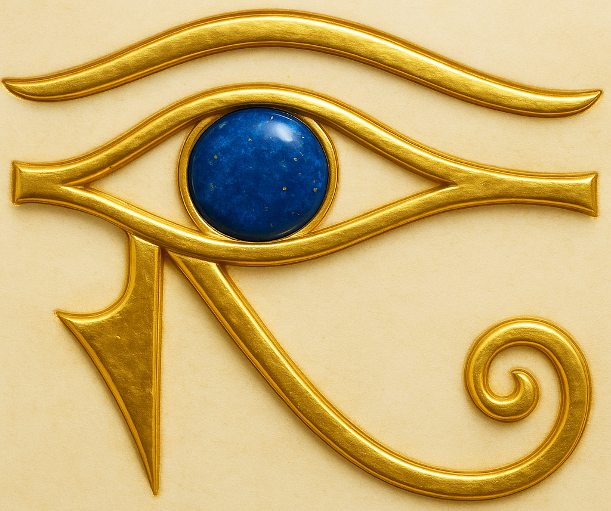
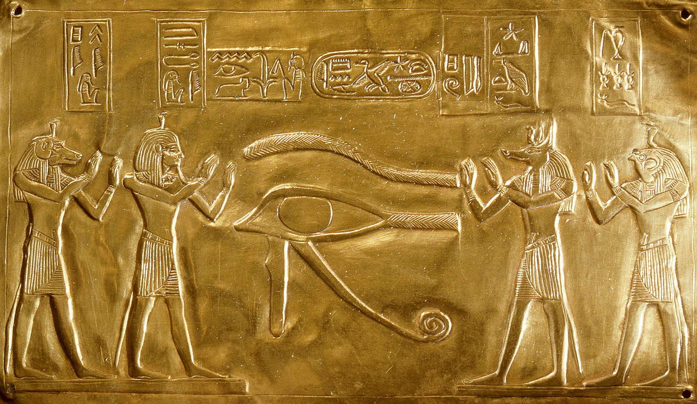

<h1 align="center">
  
  <br>Stay_Awake
</h1>

A tiny Windows tray utility that keeps your computer **awake** (blocks sleep/hibernation) while still allowing the **display to sleep**. Built with Python + tkinter; distributed as PyInstaller **onefile** and **onedir** builds.

## Features

* **Prevents system sleep/hibernation** while running; automatically restores normal behavior on exit.
* **System tray** icon with a simple menu (Show Window / Quit).
* **Native look** (`ttk` buttons, no gaudy colors); buttons at the bottom.
* **Minimize behavior:** title-bar **“\_”** and the **Minimize to System Tray** button both hide the window to the tray.
* **Close (X)** in the main window exits the app completely.
* **Icon / image priority** for the main/tray image:

  1. Embedded base64 (if you add one)
  2. A file named `Stay_Awake_icon.*` next to the EXE/script
  3. A drawn fallback glyph (so it never crashes)
* **Auto-scaling:** the window image is resized to fit (longest side ≤ **512 px** by default).

---

## Download & Run (Windows)

You’ll see **three ZIPs** attached to each GitHub Release:

### 1) Onefile ZIP — single EXE (+ optional icon files)

* **What’s inside:** `Stay_Awake.exe` (and possibly `Stay_Awake_icon.*`).
* **Extract (Explorer):** Right-click ZIP -> **Extract All…** -> open the folder.
* **Extract (PowerShell):**

  ```powershell
  Expand-Archive -Path .\Stay_Awake_<ver>_windows_onefile.zip -DestinationPath .\Stay_Awake_onefile -Force
  ```
* **Run:** double-click `Stay_Awake.exe`.
  Optionally put `Stay_Awake_icon.*` alongside it to control the image/tray icon.

### 2) Onedir ZIP — full app folder (EXE + support files)

* **What’s inside:** the **contents** of `dist/Stay_Awake/` (the EXE, DLLs, libs) placed at the ZIP **root**, plus any `Stay_Awake_icon.*`.
* **Important:** **extract everything** and keep the folder structure intact.
* **Extract (Explorer):** Right-click ZIP -> **Extract All…**
* **Extract (PowerShell):**

  ```powershell
  Expand-Archive -Path .\Stay_Awake_<ver>_windows_onedir.zip -DestinationPath .\Stay_Awake_onedir -Force
  ```
* **Run:** in the extracted folder, double-click `Stay_Awake.exe`.

> Tip: Don’t run from inside the ZIP viewer. Always extract first.

### 3) `Stay_Awake-x.y.z.zip` - run from source (if python and dependencies are pre-installed)

* Source_code.zip -> downloads to Stay_Awake-x.y.z.zip
* Dependencies
- Python 3.13+ recommended
- pip install wakepy --no-cache-dir --upgrade --check-build-dependencies --upgrade-strategy eager --verbose
- pip install pystray --no-cache-dir --upgrade --check-build-dependencies --upgrade-strategy eager --verbose
- pip install Pillow --no-cache-dir --upgrade --check-build-dependencies --upgrade-strategy eager --verbose
* From `Stay_Awake-x.y.z.zip` extract 2 files: `Stay_Awake.py` `Stay_Awake_icon.png`
- in a `cmd` box or `.bat` file run `pythonw.exe Stay_Awake.py` (the `cmd` box can then be closed)


---
## From Source (optional)

**Requirements:** Windows 10+, Python **3.13+** recommended.

```powershell
pip install wakepy --no-cache-dir --upgrade --check-build-dependencies --upgrade-strategy eager --verbose
pip install pystray --no-cache-dir --upgrade --check-build-dependencies --upgrade-strategy eager --verbose
pip install Pillow  --no-cache-dir --upgrade --check-build-dependencies --upgrade-strategy eager --verbose

# Run
pythonw .\Stay_Awake.py
```

---

## Build Locally (PyInstaller)

Onefile:

```powershell
rmdir /s /q .\dist  2>$null
rmdir /s /q .\build 2>$null
del /q .\Stay_Awake.spec 2>$null
pyinstaller --clean --onefile --windowed --noconsole --name "Stay_Awake" Stay_Awake.py --icon "Stay_Awake_icon.ico"

# Optional: copy to top level
copy /y ".\dist\Stay_Awake.exe" ".\Stay_Awake.exe"
```

Onedir:

```powershell
rmdir /s /q .\dist  2>$null
rmdir /s /q .\build 2>$null
del /q .\Stay_Awake.spec 2>$null
pyinstaller --clean --onedir --windowed --noconsole --name "Stay_Awake" Stay_Awake.py --icon "Stay_Awake_icon.ico"

# Place optional icons next to the EXE:
copy /y Stay_Awake_icon.* ".\dist\Stay_Awake\" 2>$null
```

Zip (contents at root):

```powershell
Compress-Archive -Path ".\dist\Stay_Awake\*" -DestinationPath ".\Stay_Awake_onedir.zip" -Force -CompressionLevel Optimal
```

---


**Note on icons (CI workflow):** The GitHub Actions workflow pre-builds a multi-size `Stay_Awake_icon.ico` (e.g., 16/32/48/64/128/256 px) before packaging, and passes it to PyInstaller. See the workflow YML in `.github/workflows/` for the exact steps.

## Release Automation (GitHub Actions)

* On **Release -> Published**, the workflow builds both **onefile** and **onedir**, zips them, **lists the zip contents**, and attaches both assets to the release.
* ZIP names are derived from the **release tag** (sanitized), not `__version__` in the code.
* The workflow also copies any `Stay_Awake_icon.*` at the repo root into both deliverables and prints exactly which icon files were included.

---

## Security / SmartScreen

Unsigned, freshly built executables can be flagged by Windows SmartScreen/Defender. If blocked:

* Click **More info -> Run anyway**, or
* Add an exclusion in Defender, or
* Submit a **false-positive** report to Microsoft.

---

## Troubleshooting

* **No tray icon?** It may be hidden/combined; set “Always show all icons in the taskbar” or expand the overflow area.
* **Sleeps anyway?** Another power manager may override; check your power plan or OEM tools.
* **Minimize didn’t hide to tray?** Ensure you’re on the latest release; both the **“\_”** and the **Minimize to System Tray** button should withdraw the window.

---
## The EYE OF HORUS

<p align="center">
  
</p>
<p align="center">
  <em>The ancient Egyptian "Eye of Horus" (aka "Wadjet") symbol is a powerful emblem of protection, healing, and divine vigilance that, metaphorically, never sleeps.</em><br><br>
  <em>The "Eye of Horus" is the ancient Egyptian symbol of protection, healing, and restoration, derived from the mythical battle where Horus lost his eye, which was later magically restored.</em><br><br>
</p>

### https://egypt-museum.com/mummy-plaque-of-psusennes-i/

At the heart of the golden image composition lies *Wadjet*, the *Eye of Horus*.

Flanking it are the vigilant *Four Sons of Horus*, each portrayed with raised arms in reverent supplication.

These guardian deities; 
- *Hapi* (baboon-headed, protector of the lungs),
- *Imsety* (human-headed, guardian of the liver),
- *Duamutef* (jackal-headed, keeper of the stomach),
- *Qebehsenuef* (falcon-headed, defender of the intestines)    

are more commonly seen presiding over Canopic jars. 

Here, however, they appear as living shields, encircling the sacred Eye in an eternal act of guardianship.

Above the tableau, their names are elegantly inscribed in hieroglyphs, accompanied by the royal cartouche of *Psusennes I*.

A fine linear frame encloses the scene, with tiny pierced holes at each corner, practical in design, allowing the plaque to be stitched securely to the mummy wrappings.
